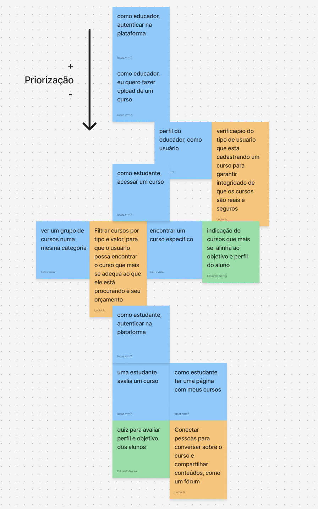

# Elicitação de requisitos

## Técnica: Brainstorming

O brainstorming é uma técnica para geração de ideias em torno de um tópico, sendo uma reunião onde pessoas sugerem e exploram ideias sem serem criticadas.

Para a realização do brainstorming utilizamos um quadro do FigJam

A técnica foi dividida nos seguintes passos:
- Geração de ideia: Durante 4 minutos os participantes eram livres para expor suas ideias no quadro
- Consolidação: Os usuários detalharam e compartilharam suas ideias com os outros integrantes
- Agrupamento: A ideiais similares foram agrupadas por similaridade e combinadas
- Priorização: As ideias resultantes foram priorizadas

O resultado da aplicação da técnica pode ser observada na imagem abaixo:

